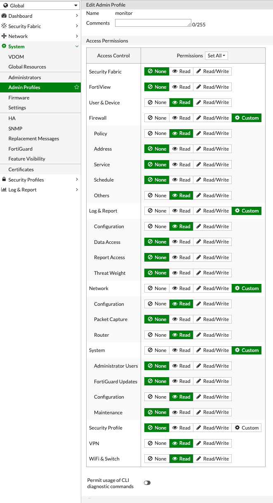

# Fortigate Prometheus exporter for Kubernetes

This repository demonstrates how to deploy the prometheus exporter [fortigate-exporter](https://github.com/bluecmd/fortigate_exporter) on Kubernetes to monitor one fortigate firewall. 
> **Info: It is possible to monitor multiple fortigates and also only specific metrics** 

## Requirements

### System requirements for installation
- makefile
- kubectl
- git

### Already installed within your Kubernetes Cluster
- Prometheus

## Installation

### Clone this repository
```
git clone <Github-Repo-URL>
```

### FortiGate Access Profile 
Ensure that the following Profile exist on your fortigate. You can create it via CLI **or** UI.

### Create Access Profile via CLI

```
config system accprofile
    edit "monitor"
        # global scope will fail on non multi-VDOM firewall
        set scope global
        set authgrp read
        # As of FortiOS 6.2.1 it seems `fwgrp-permissions.other` is removed,
        # use 'fwgrp read' to get load balance servers metrics
        set fwgrp custom
        set loggrp custom
        set netgrp custom
        set sysgrp custom
        set vpngrp read
        set wifi read
        # will fail for most recent FortiOS
        set system-diagnostics disable
        config fwgrp-permission
            set policy read
            set others read
        end
        config netgrp-permission
            set cfg read
            set route-cfg read
        end
        config loggrp-permission
            set config read
        end
        config sysgrp-permission
            set cfg read
        end
    next
end
```

### Create Access Profile via UI


### Create Rest API User
After that create a new "REST API Admin" under `System/Administrators` and name it something like `prometheus`. **Note the API Key!**

### Example fortigate.env file
You have now completed all preparations! Now it´s time to create the `fortigate.env` file and enter the URL of your firewall and the API Key.
> **Make sure that you configured your fortigate firewall with a valid certificate** 

```yml
# fortigate.env
URL=https://fw.example.com
FORTIGATE_API_TOKEN=my-secure-fortigate-api-token
```

### Deployment

```
make all
```

After this you should be able to see some metrics from your fortigate firewall in Prometheus!